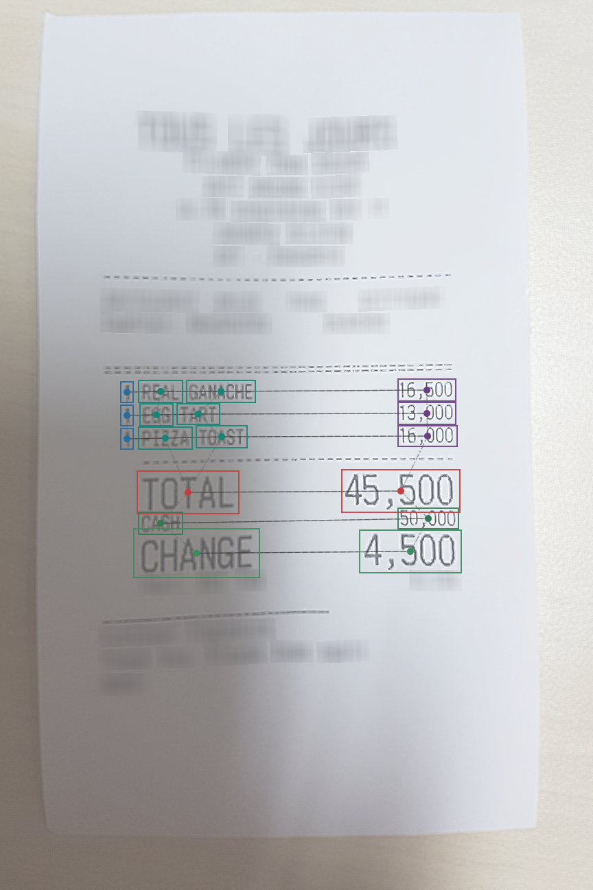

# ReceiptGraphKIE

Hybrid receipt key-information extraction using **LayoutLMv3 + symbolic
Relation-GATv2 + Word-CRF**.

```text
Receipt image + words/bounding boxes
              -> LayoutLMv3
              -> symbolic spatial relation graph
              -> Relation-GATv2 message passing
              -> hidden fusion + Word-CRF
              -> structured receipt fields
```

## Visualization



*Hybrid inference on a receipt. Bounding-box colors indicate predicted semantic
fields, while nodes and connecting lines expose the spatial graph used by
Relation-GATv2.*

## ReceiptGraph Explorer

The FastAPI dashboard supports:

- Annotated CORD research samples and uploaded real receipts.
- EasyOCR for uploaded images.
- Word, bounding-box, semantic-label and confidence overlays.
- Interactive KNN, LEFT, RIGHT, ABOVE, BELOW, SAME_LINE and
  NEXT_LINE_COLUMN relations.
- Neighbor geometry and final-layer graph attention.
- Structured JSON/CSV export.
- Hybrid aggregate metrics and per-class F1.

```powershell
pip install -r requirements-demo.txt
python -m uvicorn app.main:app --host 127.0.0.1 --port 8000
```

Open <http://127.0.0.1:8000>. See [DEMO.md](DEMO.md) for API, Docker and
configuration instructions.

## Repository

```text
app/                    # Shared model, graph, inference, API and dashboard
Hybrid_final.ipynb      # Final Hybrid training notebook using shared modules
hybrid_model_best.zip   # Local checkpoint artifact (ignored by Git)
tests/                  # Graph, post-processing and API tests
```

## Evaluation scope

Reported metrics are word-level semantic-label F1. CORD evaluation uses
dataset-provided words and bounding boxes; accuracy on uploaded receipts also
depends on OCR quality and domain similarity.
